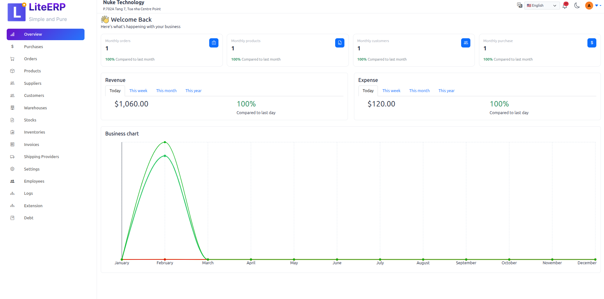
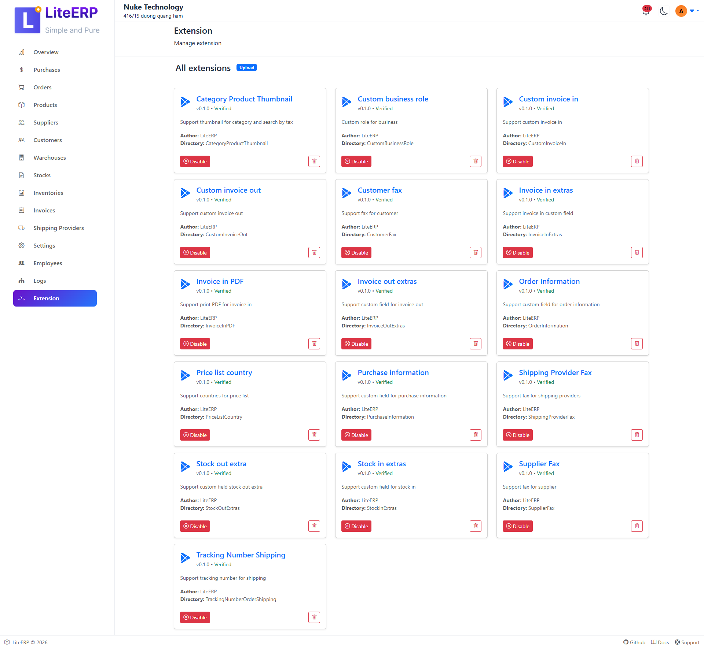

  

<h1 align="center">LiteERP</h1>

  Lightweight Open-Source ERP for internal business operations.

---

  

  

---

## 🎯 Who Is LiteERP Built For?

LiteERP is designed for **small and medium-sized businesses (SMEs)** that need a **clean, operational ERP core** without enterprise-level complexity.

Typical use cases include:
- Retail stores and retail chains
- Wholesale distributors
- Trading companies
- Import / export businesses
- SMEs managing inventory, orders, pricing, and customers

LiteERP focuses on **day-to-day internal operations**, such as:
- Product & inventory management
- Purchase & sales workflows
- Pricing rules and discounts
- Customer & supplier management
- Internal operational reporting

Industry-specific requirements — such as tax rules, accounting integration,
custom pricing logic, or workflow automation — are intentionally handled through
**Extensions**, not hardcoded into the core.

---

## 🏢 LiteERP – A Pure Core ERP, Built for Extension, Not Complexity

LiteERP is an open-source ERP built with **Laravel**, **ReactJS**, and **MySQL 8**,  
designed as a **pure, minimal core** with an **extension-first architecture**.

LiteERP is **not trying to replace SAP or Odoo**.  
Those platforms are powerful and suitable for large enterprises or broad use cases.

LiteERP follows a different philosophy:

> **Keep the core small, stable, and predictable —  
> push complexity outward into extensions.**

The system is built on:
- Clean Architecture
- Domain-Driven Design (DDD)
- Domain Events
- Very low framework coupling

---

## ⚖️ LiteERP vs Odoo vs SAP

| Aspect | LiteERP | Odoo | SAP |
|------|--------|------|-----|
| Core size | **Small & pure** | Large, feature-heavy | Very large |
| Customization | Extensions & hooks | Core overrides & modules | Consultants & customization layers |
| Infrastructure | **Low-resource friendly** | Medium–High | High–Very High |
| Upgrade safety | **High** | Medium | Low–Medium |
| Target users | SMEs & developers | SMEs–Enterprises | Large enterprises |

Odoo and SAP aim to **cover every possible business scenario inside the core**.  
This makes them powerful, but also heavy, expensive, and difficult to evolve safely.

LiteERP deliberately chooses a different path.

---

## 🧠 A Pure and Minimal Core

The LiteERP core intentionally focuses only on:
- Essential operational workflows
- Clear and predictable business rules
- Strong domain boundaries
- Authentication & authorization
- Multi-business context
- Extension loading mechanism

Instead of absorbing complexity,  
LiteERP treats **complexity as an external concern** handled by extensions.

This makes the core:
- Easy to understand
- Safe to evolve
- Fast to deploy
- Suitable for low-resource environments

---

## 🧩 Extensions – Where Real Power Lives

All domain-specific and evolving business logic lives in **Extensions**.

Extensions are:
- Fully decoupled from the core
- Loaded only when needed
- Able to hook into domain events, validation, workflows, and APIs
- Safe to develop, replace, or remove without touching core logic

### ✅ Production-ready Extensions
- **HRM Extension** – time attendance, leave management
- **SMTP Extension** – system-wide email configuration
- **Debt Extension** – basic debt & receivable tracking

### 📚 Example & Guide Extensions
LiteERP also provides **example extensions** for learning and reference:

https://github.com/liteerp-oss/liteerp/tree/dev/extension-examples

These examples demonstrate:
- Extension structure
- ServiceProvider registration
- API exposure
- React & Blade UI integration

---

## 🎨 Hybrid Frontend Architecture (React + Blade)

LiteERP uses a **Hybrid Frontend Architecture**, giving each Extension full freedom
to choose the most suitable UI approach.

### UI Options per Extension
An Extension can:
- 🧱 Use **Blade Templates**  
  Ideal for CRUD screens, admin forms, and simple internal tools.
- ⚛️ Use **ReactJS**  
  Ideal for dashboards, real-time UI, complex user interactions.
- 🖥️ Build a **fully independent dashboard**  
  Extensions can have their own layout, routing, and UI structure.

React modules are loaded dynamically via a dedicated **React ServiceProvider**.

### Why Hybrid Matters
- SMEs can start simple with Blade
- Upgrade to React only when needed
- No forced rewrite
- Lower development cost
- Better long-term flexibility

---

## 🌐 Multi-language Support

LiteERP is built with **first-class multi-language support**.

- Each Extension has its own language files
- Clear namespace separation
- Works with both Blade and React
- Easy to add new languages

Currently supported:
- 🇺🇸 English
- 🇯🇵 Japanese
- 🇻🇳 Vietnamese

---

## 📉 Lightweight by Design

LiteERP intentionally stays lightweight.

Compared to all-in-one ERP platforms:
- Lower infrastructure cost
- Faster onboarding
- Easier customization
- Better control over long-term complexity

> LiteERP invoices are **operational invoices**, not tax invoices.  
> The system focuses on **operations**, not replacing accounting software  
> or government e-invoicing platforms.

---

## ❌ What LiteERP Is NOT

- ❌ Accounting software
- ❌ Tax-compliant invoicing system
- ❌ Replacement for government e-invoice platforms

---

## 🛠 Technologies Used
- Laravel 12
- ReactJS
- MySQL 8
- PHP 8.3+
- Clean Architecture
- Domain Driven Design
- Domain Events

---

## 🧪 Testing & Quality
- Global testing
- Unit tests
- Clean code standards (Laravel & React)

---

## 📦 Documentation
https://github.com/liteerp-oss/liteerp/tree/dev/docs

---

## 🧭 Roadmap
- Extension standards & best practices
- Expanded documentation
- Reporting module
- Extension marketplace concept

---

## 🐳 Docker Setup (Quick Start)

Basic environment configuration:

  APP_TIMEZONE="Asia/Ho_Chi_Minh"

  APP_CURRENCY="USD"
  
  APP_CURRENCY_LOCALE="en-US"

Steps:
1. `docker compose build && docker compose up -d`
2. `docker exec -it LiteERP-8.3 bash`
3. `composer install`
4. `php artisan app:setup`
5. `php artisan app:create-admin {email} {password} {name}`

Visit:  
http://localhost:8002/dashboard/login

---

## 👨‍💻 Author
**Stevelee**

## 📄 Contact
📧 hoang.le.tn91@gmail.com

## 💬 Community
Discord:  
https://discord.com/channels/1468234700689772701/1468234701197152279

---

## ❤️ Support LiteERP

If LiteERP helps you:
- Give the project a ⭐
- Share feedback
- Contribute extensions or ideas
