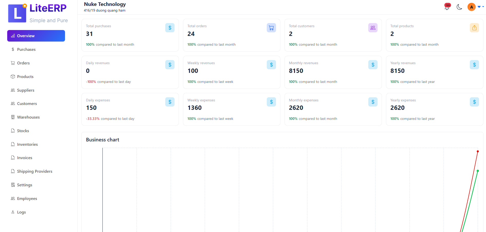

<p align="center">
  
</p>

<h1 align="center">LiteERP</h1>

<p align="center">
  Lightweight Open-Source ERP for internal business use.
</p>

🚧 Project Status: Active Development

LiteERP is under heavy development. The current version is not production-ready. This project is intended for experienced developers evaluating architecture and core design also join into team to grow together

## 📸 Screenshots



# 🏢 LiteERP – Clean Architecture & Domain Driven Design

This LiteERP is built with **ReactJS**, **Laravel**, and **MySQL8**, following modern software architecture principles including **Clean Architecture**, **Domain-Driven Design (DDD)**, and **Domain Events**.  
The project is designed for scalability, multi-business support, maintainability, and high performance.
It has extremely low framework dependencies.

---

## 🚀 Features

### ✅ Completed Features
- **Purchase**
- **Invoice In**
- **Stock In**
- **Warehouse**
- **Product**
- **Product Category**
- **Customer**
- **Customer Group**
- **Inventory**
- **Order Shipping**
- **Shipping Provider**
- **Authentication**
- **Multiple Business**
- **Log**
- **Order**
- **Invoice Out**
- **Stock Out**
- **Notification**
- **Overview Dashboard**
- **Employee Role** 
- **Storage**

### ⏳ In Progress
- **Reports**
- **Multiple Language**

---

## 🧪 Testing
- **Global Testing**
- **Unit Tests**
- **Clean Code Standard (ReactJS & Laravel)**

---

## 🛠️ Technologies Used
- **ReactJS**
- **Laravel**
- **MySQL 8**
- **Clean Architecture**
- **Domain Driven Design**
- **Domain Events**

---

## 🏗️ System Architecture

### Clean Architecture Layers

```
/core
├── Domain
│   ├── Entities
│   ├── ValueObjects
│   ├── Events
│   ├── Services
│   └── Repository Interfaces
│
├── Application
│   ├── UseCases
│   ├── DTOs
│   └── Handlers
│
├── Infrastructure
│   ├── Persistence (Eloquent, DB)
│   ├── Event Handlers
│   ├── Providers
│
└── Resources
    └── js
        └── ReactJS UI
```

---

## 🧩 Domain Driven Design (DDD)

### Core Concepts
- **Entity** – domain objects with identity  
- **Value Object** – objects compared by value  
- **Aggregate & Aggregate Root** – consistent clusters of domain logic  
- **Domain Service** – domain logic not tied to a specific entity  
- **Repository Interface** – abstracted persistence  
- **Event** – communication between domain modules  

### Example Domain Events:
Event::dispatch("erp.user.create", $data);

Event::listener("erp.user.*", function(string $eventName, array $data));

---


## 🔄 Module Communication
Modules communicate via **Domain Events**, enabling:

- Loose coupling  
- High scalability  
- Easier testing  
- Event-driven workflow  


---

## 📦 Multiple Business Support
- A user can belong to multiple businesses  
- Each request is processed under the selected `current_business`  
- Fully isolated business data  
- Managed through middleware + Redux  

---


## 🔐 Authentication
- JWT authentication  
- Refresh token  
- Multi-business session  
- Role & Permission per business  

---

## 📝 Coding Standards
- PSR-12 (Laravel)
- Event-driven communication
- Clear domain separation
- Consistent folder structure

---

## 🧭 Roadmap
- [x] Notification Center  
- [ ] Reporting Engine  
- [x] Overview Dashboard  
- [ ] Extended test coverage  
- [ ] Realtime event streaming (WebSocket)  
- [ ] Reports
- [ ] Multiple Language
- [ ] Extensions

---

## 📄 License
This project uses a private license.  
All rights reserved.

---

## 📄 Diagram Event 

I will continue update to easy to understand

https://drive.google.com/file/d/1acR1X12C4dLYNyK7w4grxWdTnfyswQDi/view?usp=sharing

--- 

## 📦 Setup by Docker 

Setup basic information for business, you need change information like business information working for. 

`APP_TIMEZONE="Asia/Ho_Chi_Minh"`

`APP_CURRENCY="USD"`

`APP_CURRENCY_LOCALE="en-US"` 

You need config SMTP mail, timezone at `./app/.env` before start.

- First go to root folder and run `docker compose build && docker compose up -d` 
- Next login in to docker container `docker exec -it erpsoft-8.3 bash`
- Next run `composer install`, `cp -r ./.env.example .env`
- Next run `php artisan generate:key`
- Next run `php artisan migrate`
- Next run `php artisan storage:link`
- Next run `php artisan jwt:generate-keys` to generate private key and public key for Json Web Token
- Next run `php artisan app:create-admin {email} {password} {name}` to create admin account
- Next run `php artisan queue:work --queue=low,default,high`
- Next run `php artisan schedule:work`
- Last step exit docker container and go to `./app` and run `npm run dev` or `npm run build` for production.

Visit: http://localhost:8001/dashboard/login

Note: You can change password for mysql account at `docker-compose.yml` 

--- 

## 👨‍💻 Author
**Stevelee**  

LiteERP

## 📄 Contact

Contact email: hoang.le.tn91@gmail.com

## ❤️ Support LiteERP

If this project helps you, consider sponsoring via GitHub Sponsors.